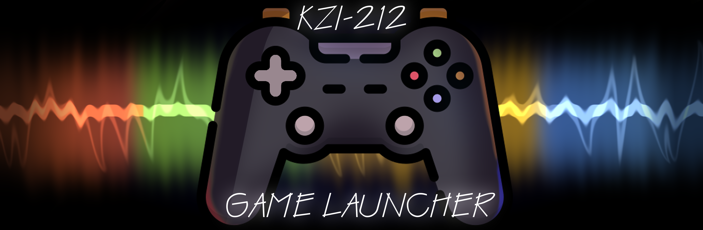

# GameLauncher

<h1 align="center">
  
</h1>

Проект: GameLauncher - Лаунчер игр
 - Группа: КЗИ-212
 - Руководитель проекта: Матвеюк Ольга Васильевна
 - Лидер группы: Рогов Вадим

Разработчики:
- Рогов Вадим - Общая разработка приложения, разработка игр "КрестикиНолики", "Кликер", "2048"; формирование общего интерфейса приложения; организация работы локальной базы данных. - 90%
- Малый Денис - Разработка игр "Шашки","Сапёр", разработка вспомогательной документации. - 100%
- Принцев Денис - Разработка игр "Тетрис","Арканоид". - 95%

Аналитики:
   - Савченко Семён - Техническое задание, построение диаграмм для формирования бизнес-модели проекта, участие в принятии креативных решений по проекту. - 90%
   - Шакая Арина - Техническое задание, ведение доски управления, постановка целей и задач, формирование теоретических сведений и технической документации. - 100%
Тестировщики:
   - Нурпеисова Камила - Разработка плана тестирования, тестирование приложения, выявление багов, разработка макетов различных блоков приложения. - 100%
   - Любицкая Алина - Разработка плана тестирования; тестирование приложения, выявление багов;
разработка графической части интерфейса приложения. - 100%

## О приложении

GameLauncher - это сборник мини-игр, включающий в себя такие игры как:
 - "Крестики нолики"
 - "Шашки"
 - "Сапёр"
 - "Тетрис"
 - "Арканоид"
 - "Кликер"
 - "2048"

Приложение GameLauncher позволяет выбрать среди списка доступных игр и непосредственно поиграть в них,
при запуске приложения пользователя встречает окно авторизации, через которое пользователь может войти или зарегистрироваться.
Набранные в каждой игре очки сохраняются в базе данных.

## Наша команда

Мы - оффлайн-сервис игр, разработанный (\\и поддерживаемый) студентами группы КЗИ-212 Омского Гоcударственного Технического Университета.

## Наша доска управления

Jira: https://kzi-212.atlassian.net/jira/software/projects/DNFR/boards/1

## Прочие ссылки

GitHub: https://github.com/vadimforce/KZI-212_GameLauncher

Discord: https://discord.gg/uZDyXMgWtn

email: gamelauncher_kzi@mail.ru
